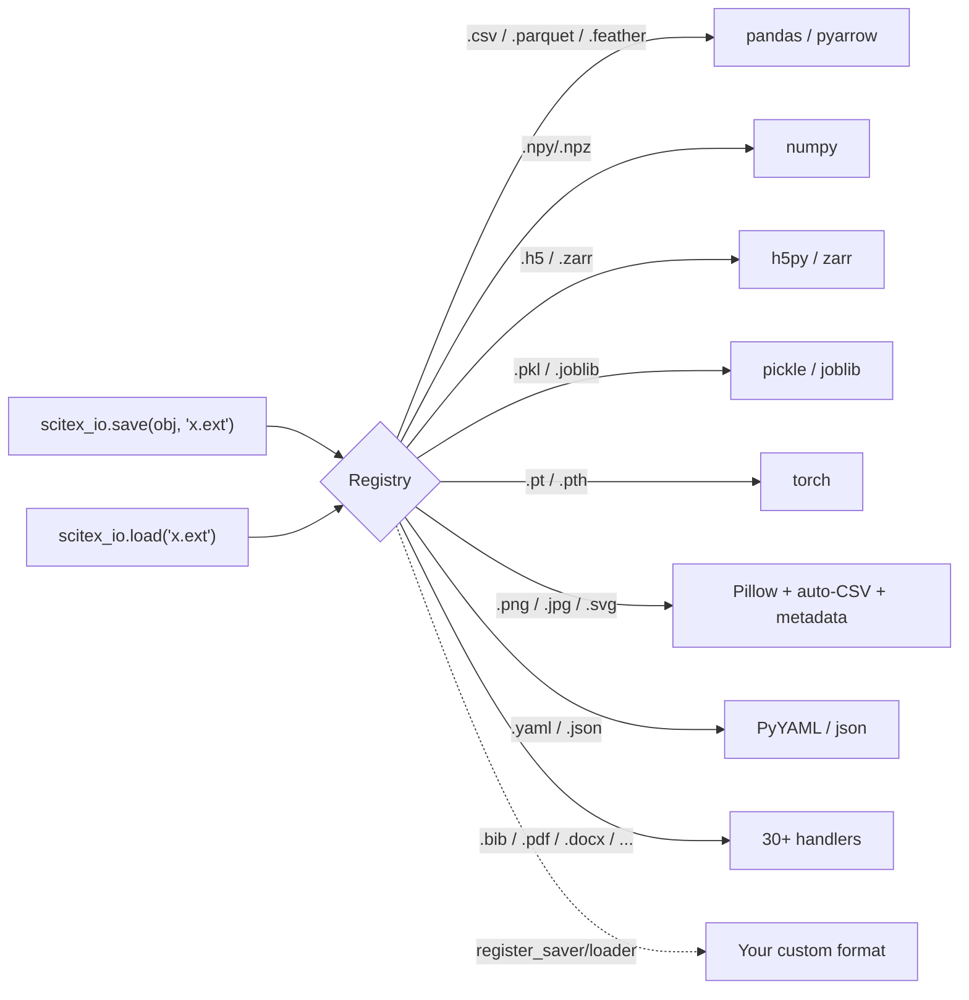
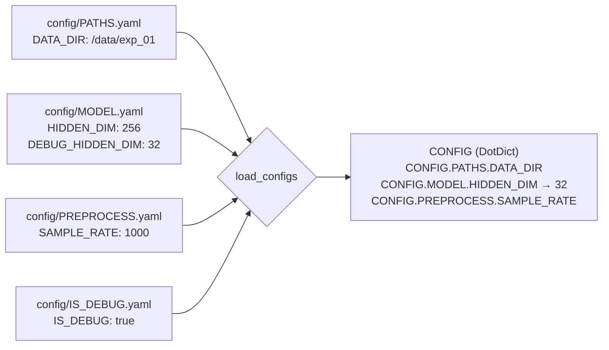
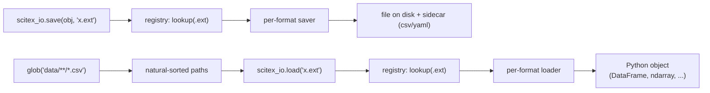

# SciTeX IO (<code>scitex-io</code>)

<p align="center">
  <a href="https://scitex.ai">
    
  </a>
</p>

<p align="center"><b>Universal scientific data I/O with plugin registry</b></p>

<p align="center">
  <a href="https://scitex-io.readthedocs.io/">Full Documentation</a> · <code>uv pip install scitex-io[all]</code>
</p>

<p align="center">
<!-- scitex-badges:start -->
<a href="https://pypi.org/project/scitex-io/"></a>
<a href="https://pypi.org/project/scitex-io/"></a>
</p>
<p align="center">
<a href="https://github.com/ywatanabe1989/scitex-io/actions/workflows/test.yml"></a>
<a href="https://github.com/ywatanabe1989/scitex-io/actions/workflows/install-test.yml"></a>
<a href="https://codecov.io/gh/ywatanabe1989/scitex-io"></a>
</p>
<p align="center">
<a href="https://scitex-io.readthedocs.io/en/latest/"></a>
<a href="https://www.gnu.org/licenses/agpl-3.0"></a>
<!-- scitex-badges:end -->
</p>

---

## Problem and Solution

| # | Problem | Solution |
|---|---------|----------|
| 1 | **Format zoo** — save/load scattered across `pd.read_csv`, `np.load`, `pickle`, `json`, `h5py`, `torch.save`, `cv2.imread`, etc. Every format = a different API | **One call** — `stx.io.save(obj, "x.ext")` / `stx.io.load("x.ext")` routes by extension across 30+ formats; plugin registry lets users register custom handlers |
| 2 | **FileNotFoundError after save** — `save()` auto-routes to `{script}_out/` but `load()` resolves cwd-relative, so the naive round-trip breaks for new users | **Predictable paths** — `symlink_from_cwd=True` flag, `CONFIG.SDIR_RUN` session path, or absolute path on both sides — documented prominently in the skill |
| 3 | **Hard-coded parameters scattered across scripts** — sample rates, thresholds, hyperparameters duplicated across files, impossible to track or share | **`load_configs()`** — loads all YAML files from `config/` into a single `DotDict` with dot-notation access; parameters version-controlled and centralized |
| 4 | **Figure + data diverge / figures without provenance** — a saved PNG has no record of the underlying DataFrame, code, or session that produced it | **Auto-CSV export + embedded metadata** — `stx.io.save(fig, "plot.png")` writes `plot.png` + `plot.csv` + `plot.yaml` atomically; `embed_metadata()` writes timestamps/session IDs into the image itself |

<details>
<summary><b>Supported Formats (30+)</b></summary>

<br>

| Category | Extensions |
|----------|-----------|
| Spreadsheet | `.csv`, `.tsv`, `.xlsx`, `.xls`, `.xlsm`, `.xlsb` |
| Columnar | `.parquet`, `.feather` |
| Scientific | `.npy`, `.npz`, `.mat`, `.hdf5`, `.h5`, `.zarr` |
| Serialization | `.pkl`, `.pickle`, `.pkl.gz`, `.joblib` |
| ML/DL | `.pth`, `.pt`, `.cbm` |
| Config | `.json`, `.yaml`, `.yml`, `.xml` |
| Database | `.db` (SQLite3) |
| Documents | `.txt`, `.md`, `.pdf`, `.docx`, `.tex`, `.log` |
| Code | `.py`, `.sh`, `.css`, `.js` |
| Images | `.png`, `.jpg`, `.jpeg`, `.gif`, `.tiff`, `.tif`, `.svg` |
| Media | `.mp4` |
| Web | `.html` |
| Bibliography | `.bib` |
| EEG | `.vhdr`, `.vmrk`, `.edf`, `.bdf`, `.gdf`, `.cnt`, `.egi`, `.eeg`, `.set`, `.con` |

</details>

## Installation

Requires Python >= 3.9.

```bash
pip install scitex-io
```

For MCP server support:

```bash
pip install scitex-io[mcp]
```

## Architecture



One call routes by extension to the right handler; the registry is the
extension point — see "Custom Format Registration" below. Figures get an
auto-CSV+yaml sidecar atomically so plot data never drifts from the image.

**Where does the file actually go?** Relative paths in `save()` are
auto-routed based on the execution context — you never specify the
output directory by hand:

| Caller | `stx.io.save(df, "results.csv")` writes to |
|---|---|
| `/path/to/analysis.py` (script) | `/path/to/analysis_out/results.csv` |
| `/path/to/exp.ipynb` (notebook) | `/path/to/exp_out/results.csv` |
| `python -i` / IPython / REPL | `/tmp/{USER}/results.csv` |

> **Absolute paths bypass routing.** `stx.io.save(df, "/data/x.csv")`
> writes to `/data/x.csv` as-is — the auto-routing rules above only
> apply when the path is relative.

Opt-in extras: `symlink_from_cwd=True` drops a symlink at
`./results.csv` pointing into the auto-routed location; `symlink_to=…`
plants a symlink at a custom path; `dry_run=True` prints the resolved
path without writing.

**Project configuration** — `load_configs()` collects every YAML under
`./config/` into one nested `DotDict`. UPPER_CASE filenames become
top-level keys; UPPER_CASE keys inside become constants. Debug mode
promotes any `DEBUG_*` sibling over its non-debug counterpart:



## Demo

```python
import scitex as stx
import pandas as pd, numpy as np

# One call — any of 30+ formats, auto-dispatched by extension
stx.io.save(pd.DataFrame({"x": [1, 2, 3]}), "data.csv")
stx.io.save(np.array([1, 2, 3]),            "data.npy")
stx.io.save({"lr": 1e-3, "epochs": 10},     "config.yaml")
stx.io.save(fig,                            "plot.png")   # + plot.csv + plot.yaml

# One call to load — extension picks the right reader
df  = stx.io.load("data.csv")
arr = stx.io.load("data.npy")
cfg = stx.io.load("config.yaml")

# Load every config/*.yaml as a DotDict (UPPER_CASE = constants)
CONFIG = stx.io.load_configs()
CONFIG.MODEL.HIDDEN_DIM            # 256
```

<details>
<summary><b>Project configuration (<code>load_configs</code>) — full example</b></summary>

<br>

```
project/
  config/
    PATHS.yaml          # DATA_DIR: /data/experiment_01
    PREPROCESS.yaml     # SAMPLE_RATE: 1000, BANDPASS: [0.5, 40]
    MODEL.yaml          # HIDDEN_DIM: 256, DROPOUT: 0.3
    IS_DEBUG.yaml       # IS_DEBUG: true
```

```python
CONFIG = stx.io.load_configs()           # loads ./config/*.yaml
CONFIG.PREPROCESS.SAMPLE_RATE            # 1000

# Debug mode: DEBUG_ prefixed keys override their counterparts
# In MODEL.yaml: { HIDDEN_DIM: 256, DEBUG_HIDDEN_DIM: 32 }
CONFIG = stx.io.load_configs(IS_DEBUG=True)
CONFIG.MODEL.HIDDEN_DIM                  # 32 (debug value promoted)
```

</details>

<details>
<summary><b>Embed provenance into figures (<code>embed_metadata</code>)</b></summary>

<br>

```python
stx.io.embed_metadata("figure.png", {
    "experiment": "exp_042", "model": "resnet50",
    "accuracy": 0.94, "timestamp": "2026-03-11",
})
meta = stx.io.read_metadata("figure.png")
meta["experiment"]              # "exp_042"
```

Supports PNG (tEXt), JPEG (EXIF), SVG (XML metadata), PDF (XMP).

</details>

<details>
<summary><b>Advanced <code>save()</code> — auto-routing, symlinks, dry-run</b></summary>

<br>

```python
# Auto path routing — relative paths resolve based on execution context:
#   Script analysis.py  → analysis_out/results.csv
#   Notebook exp.ipynb  → exp_out/results.csv
#   Interactive/IPython → /tmp/{USER}/results.csv
#   Absolute paths      → used as-is
stx.io.save(df, "results.csv")

stx.io.save(df,  "results.csv", symlink_from_cwd=True)
stx.io.save(fig, "fig1.png",    symlink_to="/data/latest/fig1.png")
stx.io.save(fig, "plot.png",    no_csv=True)              # skip auto-CSV sidecar
stx.io.save(df,  "results.csv", use_caller_path=True)     # resolve from caller script
stx.io.save(df,  "results.csv", dry_run=True)             # print path, don't write
```

</details>

<details>
<summary><b>Glob, parse, cache</b></summary>

<br>

```python
paths = stx.io.glob("data/**/*.csv")                        # natural sort: 1, 2, 10
paths = stx.io.glob("results/{exp1,exp2}/*.npy")            # brace expansion
paths, parsed = stx.io.parse_glob("sub_{id}/ses_{session}/*.vhdr")
# parsed = [{'id': '001', 'session': 'pre'}, ...]

dfs = stx.io.load("results/*.csv")                          # list of DataFrames
data = stx.io.load("large.hdf5"); data = stx.io.load("large.hdf5")  # 2nd call: cache hit
```

</details>

<details>
<summary><b>Custom format registration</b></summary>

<br>

```python
from scitex_io import register_saver, register_loader

@register_saver(".custom")
def save_custom(obj, path, **kw):
    open(path, "w").write(str(obj))

@register_loader(".custom")
def load_custom(path, **kw):
    return open(path).read()

stx.io.save("hello", "data.custom")
assert stx.io.load("data.custom") == "hello"
```

</details>

## Four Interfaces

<details open>
<summary><strong>Python API</strong></summary>

<br>

```python
from scitex_io import save, load, list_formats, register_saver, register_loader
from scitex_io import load_configs, DotDict
from scitex_io import embed_metadata, read_metadata, has_metadata

save(obj, "path.ext")        # Save any object
data = load("path.ext")      # Load any file
fmts = list_formats()        # Show all registered formats
cfg  = load_configs()        # Load ./config/*.yaml as DotDict
embed_metadata("fig.png", d) # Embed provenance into figure
```

> **[Full API reference](https://scitex-io.readthedocs.io/en/latest/api/scitex_io.html)**

</details>

<details>
<summary><strong>CLI Commands</strong></summary>

<br>

```bash
scitex-io --help-recursive          # Show all commands
scitex-io info                      # Show registered formats
scitex-io configs                   # Load and display project configs
scitex-io configs -d ./my_configs   # Custom config directory
scitex-io configs --json            # Output as JSON
scitex-io list-python-apis -vv      # List Python APIs with signatures
scitex-io --version                 # Show version
scitex-io mcp start                 # Start MCP server
scitex-io mcp doctor                # Check MCP health
scitex-io mcp list-tools -vv        # List MCP tools with parameters
```

> **[Full CLI reference](https://scitex-io.readthedocs.io/en/latest/cli.html)**

</details>

<details>
<summary><strong>MCP Server — for AI Agents</strong></summary>

<br>

AI agents can save, load, and discover formats autonomously.

| Tool | Description |
|------|-------------|
| `io_list_formats` | List all registered save/load formats |
| `io_load` / `io_save` | Load / save data in any supported format |
| `io_load_configs` | Load YAML project configurations |
| `io_register_info` | Show how to register custom formats |
| `io_glob` / `io_parse_glob` | Natsorted globbing with `{placeholder}` parsing |
| `io_get_loader` / `io_get_saver` | Look up the registered handler for an extension |
| `io_read_metadata` / `io_has_metadata` / `io_embed_metadata` | Image provenance metadata |
| `io_get_cache_info` / `io_clear_load_cache` / `io_configure_cache` | Load-cache management |
| `io_explore_h5` / `io_explore_zarr` | Print group/dataset trees |
| `io_has_h5_key` / `io_has_zarr_key` | Cheap existence checks |
| `io_json2md` | Render JSON as Markdown |
| `io_skills_list` / `io_skills_get` | Discover and fetch skill pages |

```bash
scitex-io mcp start
```

> **[Full MCP specification](https://scitex-io.readthedocs.io/en/latest/mcp.html)**

</details>

<details>
<summary><strong>Skills — for AI Agent Discovery</strong></summary>

<br>

Skills provide structured documentation that AI agents can query to discover package capabilities, API signatures, and usage patterns.

```bash
scitex-io skills list              # List available skill pages
scitex-io skills get save-and-load # Get detailed save/load documentation
scitex-io skills get glob          # Get glob/parse_glob patterns
scitex-io skills get supported-formats  # Get all format tables
```

| Skill | Content |
|-------|---------|
| `save-and-load` | Core API, path routing, symlinks, `use_caller_path` |
| `centralized-config` | `load_configs()`, DotDict, DEBUG_ override |
| `metadata-embedding` | Provenance in PNG/JPEG/SVG/PDF |
| `cache` | Load caching, reload, flush |
| `glob` | Pattern matching with natural sort and parsing |
| `linting-rules` | STX-IO001–007 lint rules |
| `supported-formats` | All 30+ format tables |
| `path-resolution` | Auto save-path routing, `scitex.path` utilities |

Also available via MCP: `io_skills_list()` / `io_skills_get(name)`.

</details>

## Demo



```python
>>> import pandas as pd, scitex_io as sio
>>> df = pd.DataFrame({"x": [1, 2, 3]})
>>> sio.save(df, "out.csv")          # routes by extension
>>> sio.load("out.csv").equals(df)
True
>>> sio.list_formats()[:5]
['.csv', '.tsv', '.xlsx', '.npy', '.npz']
```

A figure save additionally emits the underlying CSV + a figrecipe YAML
sidecar, keeping figure-and-data atomically in sync.

<details>
<summary><b>Lint Rules (STX-IO001..014 + STX-PA001..005)</b></summary>

<br>

Detected by [scitex-linter](https://github.com/ywatanabe1989/scitex-linter) when this package is installed. Run `scitex-linter list-rules --plugin io` to see live definitions.

| Rule | Severity | Trigger |
|------|----------|---------|
| `STX-IO001` | warning | `np.save / savez / savez_compressed / savetxt` → use `stx.io.save()` |
| `STX-IO002` | warning | `np.load / loadtxt / genfromtxt` → use `stx.io.load()` |
| `STX-IO003` | warning | `pd.read_csv / parquet / excel / hdf / pickle / json / feather / orc / table` → use `stx.io.load()` |
| `STX-IO004` | warning | `df.to_csv / parquet / excel / hdf / pickle / json / feather / html / orc` → use `stx.io.save()` |
| `STX-IO005` | warning | `pickle.dump / dumps / load / loads` (incl. `cPickle`) → use `stx.io.save()/load()` |
| `STX-IO006` | warning | `json.dump / dumps / load / loads` → use `stx.io.save()/load()` |
| `STX-IO007` | warning | `.savefig(...)` → use `stx.io.save(fig, path)` for metadata embedding |
| `STX-IO008` | warning | `torch.save / load` → use `stx.io.save()/load()` |
| `STX-IO009` | warning | `joblib.dump / load` → use `stx.io.save()/load()` |
| `STX-IO010` | warning | `yaml.dump / safe_dump / dump_all / load / safe_load / full_load` → use `stx.io.save()/load()` |
| `STX-IO011` | warning | `scipy.io.savemat / loadmat` → use `stx.io.save()/load()` |
| `STX-IO012` | warning | `cv2.imread / imwrite`, `PIL.Image.open`, `plt.imsave / imread`, `imageio.*` → use `stx.io.save()/load()` |
| `STX-IO013` | warning | `h5py.File(...)` → use `stx.io.save()/load()` for HDF5 |
| `STX-IO014` | warning | `stx.io.save / load` called with an extension that has no registered handler — register one with `register_saver/register_loader` |
| `STX-PA001` | warning | Absolute path passed to `stx.io` — prefer relative for reproducibility |
| `STX-PA002` | warning | `open(...)` → use `stx.io.save()/load()` for auto-logging |
| `STX-PA003` | info | `os.makedirs / mkdir` — `stx.io.save()` auto-creates directories |
| `STX-PA004` | warning | `os.chdir(...)` — scripts should run from project root |
| `STX-PA005` | info | Relative path missing `./` prefix — use `./file.ext` for explicit intent |

</details>

## Part of SciTeX

`scitex-io` is part of [**SciTeX**](https://scitex.ai). Install via
the umbrella with `pip install scitex[io]` to use as
`scitex.io` (Python) or `scitex io ...` (CLI).

```python
import scitex

@scitex.session
def main(CONFIG=scitex.INJECTED):
    data = scitex.io.load("input.csv")     # auto-tracked by clew
    result = process(data)
    scitex.io.save(result, "output.csv")   # auto-tracked by clew
    return 0
```

`scitex.io` delegates to `scitex_io` — they share the same API and registry.

The SciTeX system follows the Four Freedoms for Research below, inspired by [the Free Software Definition](https://www.gnu.org/philosophy/free-sw.en.html):

>Four Freedoms for Research
>
>0. The freedom to **run** your research anywhere — your machine, your terms.
>1. The freedom to **study** how every step works — from raw data to final manuscript.
>2. The freedom to **redistribute** your workflows, not just your papers.
>3. The freedom to **modify** any module and share improvements with the community.
>
>AGPL-3.0 — because we believe research infrastructure deserves the same freedoms as the software it runs on.

---

<p align="center">
  <a href="https://scitex.ai" target="_blank"></a>
</p>

<!-- EOF -->
