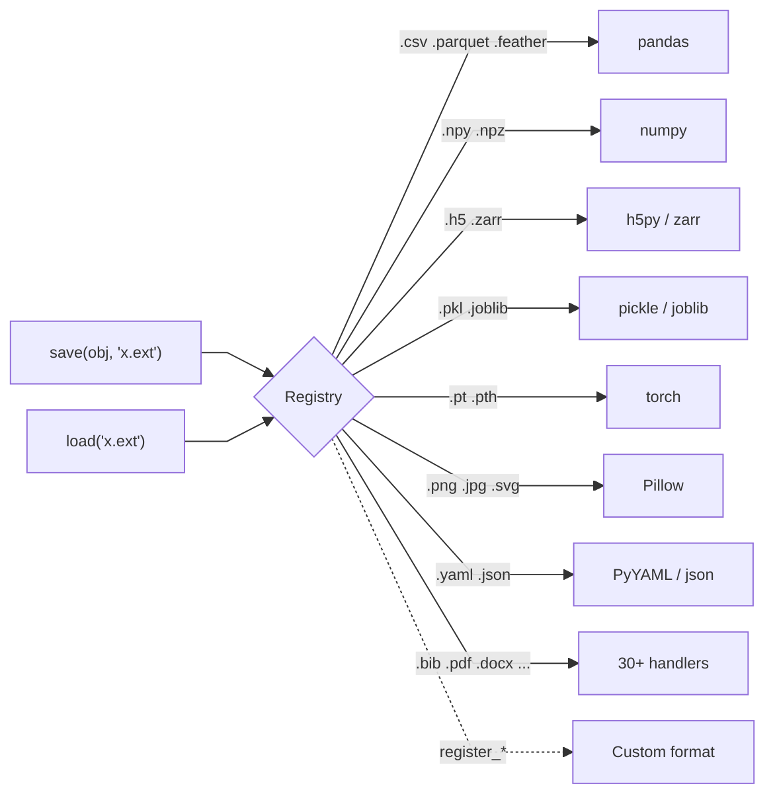

<!-- ---
!-- Timestamp: 2026-05-11 16:50:42
!-- Author: ywatanabe
!-- File: /home/ywatanabe/proj/scitex-io/README.md
!-- --- -->

# SciTeX IO (<code>scitex-io</code>)

<p align="center">
  <a href="https://scitex.ai">
    
  </a>
</p>

<p align="center"><b>Universal scientific data I/O with plugin registry</b></p>

<p align="center">
  <a href="https://scitex-io.readthedocs.io/">Full Documentation</a> · <code>uv pip install scitex-io[all]</code>
</p>

<p align="center">
<!-- scitex-badges:start -->
<a href="https://pypi.org/project/scitex-io/"></a>
<a href="https://pypi.org/project/scitex-io/"></a>
</p>
<p align="center">
<a href="https://github.com/ywatanabe1989/scitex-io/actions/workflows/test.yml"></a>
<a href="https://github.com/ywatanabe1989/scitex-io/actions/workflows/install-test.yml"></a>
<a href="https://codecov.io/gh/ywatanabe1989/scitex-io"></a>
</p>
<p align="center">
<a href="https://scitex-io.readthedocs.io/en/latest/"></a>
<!-- scitex-badges:end -->
</p>

---

## Problem and Solution

| # | Problem | Solution |
|---|---------|----------|
| 1 | **Format zoo** — save/load scattered across `pd.read_csv`, `np.load`, `pickle`, `json`, `h5py`, `torch.save`, `cv2.imread`, etc. Every format = a different API | **One call** — `sio.save(obj, "x.ext")` / `sio.load("x.ext")` routes by extension across 30+ formats; plugin registry lets users register custom handlers |
| 2 | **Outputs scattered, cwd-dependent, mkdir-heavy** — saves land in whatever cwd happens to be; nested paths need explicit `os.makedirs()`; outputs drift away from the script that produced them | **Caller-anchored relative paths** — `sio.save(df, "./sub/dir/results.csv")` resolves relative to the calling script and writes to `{caller}_out/sub/dir/results.csv`; intermediate dirs auto-created, no `mkdir` calls needed |
| 3 | **Hard-coded parameters scattered across scripts** — sample rates, thresholds, hyperparameters duplicated across files, impossible to track or share | **`load_configs()`** — loads all YAML files from `config/` into a single `DotDict` with dot-notation access; parameters version-controlled and centralized |


## Quick Start

```python
import scitex_io as sio
import pandas as pd
import numpy as np

# Demo Data
df_orig = pd.DataFrame({"x": [1, 2, 3]})
arr_orig = np.array([1, 2, 3])
params_orig = {"lr": 1e-3, "epochs": 10}

# Unified Saving API
sio.save(df_orig, "data.csv")
sio.save(arr_orig, "data.npy")
sio.save(params_orig, "config.yaml")

# Unified Loading API
df_loaded = sio.load("data.csv")
arr_loaded = sio.load("data.npy")
params_loaded = sio.load("config.yaml")

# Round-trip check
assert df_loaded.equals(df_orig)
assert np.array_equal(arr_loaded, arr_orig)
assert params_loaded == params_orig
```


<details>
<summary><b>Supported Formats (30+) and Customization</b></summary>

<br>

| Category | Extensions |
|----------|-----------|
| Spreadsheet | `.csv`, `.tsv`, `.xlsx`, `.xls`, `.xlsm`, `.xlsb` |
| Columnar | `.parquet`, `.feather` |
| Scientific | `.npy`, `.npz`, `.mat`, `.hdf5`, `.h5`, `.zarr` |
| Serialization | `.pkl`, `.pickle`, `.pkl.gz`, `.joblib` |
| ML/DL | `.pth`, `.pt`, `.cbm` |
| Config | `.json`, `.yaml`, `.yml`, `.xml` |
| Database | `.db` (SQLite3) |
| Documents | `.txt`, `.md`, `.pdf`, `.docx`, `.tex`, `.log` |
| Code | `.py`, `.sh`, `.css`, `.js` |
| Images | `.png`, `.jpg`, `.jpeg`, `.gif`, `.tiff`, `.tif`, `.svg` |
| Media | `.mp4` |
| Web | `.html` |
| Bibliography | `.bib` |
| EEG | `.vhdr`, `.vmrk`, `.edf`, `.bdf`, `.gdf`, `.cnt`, `.egi`, `.eeg`, `.set`, `.con` |

Need a format not listed above? Register a custom handler with
`register_saver` / `register_loader` and `sio.save()` / `sio.load()`
will dispatch to it by extension just like a built-in.

```python
from scitex_io import register_saver, register_loader

@register_saver(".custom")
def save_custom(obj, path, **kw):
    open(path, "w").write(str(obj))

@register_loader(".custom")
def load_custom(path, **kw):
    return open(path).read()

sio.save("hello", "data.custom")
assert sio.load("data.custom") == "hello"
```

</details>

## Installation

```bash
uv pip install "scitex-io[all]"
```

<details>
<summary><b>Per-module extras</b></summary>

<br>

| Extra | Pulls in |
|---|---|
| `scientific` | scipy, h5py, zarr, numcodecs, matplotlib (HDF5 / zarr / scientific I/O) |
| `mcp` | fastmcp (MCP server for agents) |
| `all` | `scientific` + `mcp` (recommended) |
| `dev` | pytest, pytest-cov, plotly, Pillow, + every optional dep so the test suite runs |
| `docs` | Sphinx + RTD theme + myst-parser (docs build only) |

```bash
uv pip install "scitex-io[scientific]"   # HDF5 / zarr / parquet stack
uv pip install "scitex-io[mcp]"          # MCP server only
uv pip install -e ".[dev]"               # editable install for contributors
```

</details>

## How it works

### 1. Format detection by extension

`save()` / `load()` pick the right reader/writer from the file
extension via a plugin registry — just as OS does. Custom handlers
can be available using `register_saver` / `register_loader`.



### 2. `save(obj, out.ext)` in `/path/to/script.py` → `/path/to/script_out/out.ext`

Relative paths in `save()` resolve **relative to the calling script /
notebook**, not the working directory. Scripts and outputs are tied as locations.

```
/path/to/project/
├── config/                              # see §3
│   └── ...
└── scripts/
    └── xxx/
        ├── filename.py                  # sio.save(df, "results.csv")
        └── filename_out/                # auto-created sibling of the script
            └── results.csv              # output lands here
```

> | Caller                          | `sio.save(df, "sub/dir/results.csv")` writes to  |
> |---------------------------------|--------------------------------------------------|
> | `/path/to/analysis.py` (script) | `/path/to/analysis_out/sub/dir/results.csv`      |
> | `/path/to/exp.ipynb` (notebook) | `/path/to/exp_out/sub/dir/results.csv`           |
> | `python -i` / IPython / REPL    | `~/.scitex/io/runtime/cache/sub/dir/results.csv` |

> **Bare filename or any relative path** — `"results.csv"`,
> `"sub/dir/results.csv"`, and `"./sub/dir/results.csv"` all work; the
> whole path is appended under the caller's output anchor.
>
> **Intermediate directories created automatically** — no
> `os.makedirs()` / `Path.mkdir()` calls needed on the caller side.

<details>
<summary><b>Advanced <code>save()</code> — absolute paths, symlinks, dry-run</b></summary>

<br>

> **Absolute paths bypass auto-routing.** `sio.save(df, "/data/x.csv")`
> writes to `/data/x.csv` as-is — caller-anchored routing (§2) only
> applies when the path is relative.

```python
sio.save(df, "/data/x.csv")                            # absolute → used as-is
```

> **Symlinks and dry-run.** `symlink_from_cwd=True` drops a symlink at
> `./results.csv` pointing into the auto-routed location;
> `symlink_to=…` plants a symlink at a custom path; `dry_run=True`
> prints the resolved path without writing.

```python
sio.save(df,  "results.csv", symlink_from_cwd=True)
sio.save(fig, "fig1.png",    symlink_to="/data/latest/fig1.png")
sio.save(df,  "results.csv", use_caller_path=True)     # resolve from caller script
sio.save(df,  "results.csv", dry_run=True)             # print path, don't write
```

</details>

### 3. Centralized project configuration

Scientific projects benefit from keeping parameters — 
hyperparameters, paths, thresholds — out of the scripts that consume
them, as a single source of truth.

`CONFIG = load_configs()` collects every YAML under
`<project-root>/config/` into one nested `DotDict`. Parameters are
then accessible as `CONFIG.YAML_FILE_NAME.FIELD_NAME`.

> **UPPER_CASE normalisation.** YAML filenames and field names are
> recognised in UPPER_CASE, following Python's convention for
> user-defined parameters. `model.yaml` with `hidden_dim: 256` lands
> at `CONFIG.MODEL.HIDDEN_DIM` regardless of source casing.
>
> **Conflict handling.** When an UPPER/lower pair collide (e.g.
> `MODEL.yaml` next to `model.yaml`, or `HIDDEN_DIM` next to
> `hidden_dim`), the UPPER variant is prioritised and a `UserWarning`
> is emitted pointing at the conflict.


```
/path/to/project/
├── config/
│   ├── PATHS.yaml                       # DATA_DIR: /data/experiment_01
│   ├── PREPROCESS.yaml                  # SAMPLE_RATE: 1000, BANDPASS: [0.5, 40]
│   ├── MODEL.yaml                       # HIDDEN_DIM: 256, DROPOUT: 0.3
│   └── IS_DEBUG.yaml                    # IS_DEBUG: true
└── scripts/
    └── xxx/
        └── filename.py                  # CONFIG = sio.load_configs()
                                         #   CONFIG.MODEL.DROPOUT       → 0.3
                                         #   CONFIG.PREPROCESS.SAMPLE_RATE → 1000
```

```python
CONFIG = sio.load_configs()           # loads ./config/*.yaml
CONFIG.PREPROCESS.SAMPLE_RATE            # 1000

# Debug mode: DEBUG_ prefixed keys override their counterparts
# In MODEL.yaml: { HIDDEN_DIM: 256, DEBUG_HIDDEN_DIM: 32 }
CONFIG = sio.load_configs(IS_DEBUG=True)
CONFIG.MODEL.HIDDEN_DIM                  # 32 (debug value promoted)
```

<details>
<summary><b>Debug mode for parameters</b></summary>

<br>

When debugging or developing, flipping parameters speeds up iteration.
Any `DEBUG_*` sibling overrides its non-debug counterpart at load time
(e.g. `CONFIG.MY.DEBUG_PARAM` replaces `CONFIG.MY.PARAM`), so a single
`IS_DEBUG.yaml` flips the whole project between production and debug
values.

> **Equivalent triggers** — these three all enable debug mode:
> `IS_DEBUG.yaml` with `IS_DEBUG: true`, `load_configs(IS_DEBUG=True)`,
> or running under `CI=True`.

</details>

### 4. Linter for Migration and Hooks

`scitex-io` ships 14 IO-specific (`STX-IO001..014`) and 5 path-handling
(`STX-PA001..005`) lint rules. They are detected automatically by
[`scitex-dev`](https://github.com/ywatanabe1989/scitex-dev)'s linter,
which is already a hard dependency of `scitex-io` — no extra install
needed.

```bash
scitex-dev linter check-files src/           # lint a tree
scitex-dev linter list-rules --category io   # show live rule definitions
```

<details>
<summary><b>Rule reference (STX-IO001..014 + STX-PA001..005)</b></summary>

<br>

| Rule | Severity | Trigger |
|------|----------|---------|
| `STX-IO001` | warning | `np.save / savez / savez_compressed / savetxt` → use `sio.save()` |
| `STX-IO002` | warning | `np.load / loadtxt / genfromtxt` → use `sio.load()` |
| `STX-IO003` | warning | `pd.read_csv / parquet / excel / hdf / pickle / json / feather / orc / table` → use `sio.load()` |
| `STX-IO004` | warning | `df.to_csv / parquet / excel / hdf / pickle / json / feather / html / orc` → use `sio.save()` |
| `STX-IO005` | warning | `pickle.dump / dumps / load / loads` (incl. `cPickle`) → use `sio.save()/load()` |
| `STX-IO006` | warning | `json.dump / dumps / load / loads` → use `sio.save()/load()` |
| `STX-IO007` | warning | `.savefig(...)` → use `sio.save(fig, path)` for metadata embedding |
| `STX-IO008` | warning | `torch.save / load` → use `sio.save()/load()` |
| `STX-IO009` | warning | `joblib.dump / load` → use `sio.save()/load()` |
| `STX-IO010` | warning | `yaml.dump / safe_dump / dump_all / load / safe_load / full_load` → use `sio.save()/load()` |
| `STX-IO011` | warning | `scipy.io.savemat / loadmat` → use `sio.save()/load()` |
| `STX-IO012` | warning | `cv2.imread / imwrite`, `PIL.Image.open`, `plt.imsave / imread`, `imageio.*` → use `sio.save()/load()` |
| `STX-IO013` | warning | `h5py.File(...)` → use `sio.save()/load()` for HDF5 |
| `STX-IO014` | warning | `sio.save / load` called with an extension that has no registered handler — register one with `register_saver/register_loader` |
| `STX-PA001` | warning | Absolute path passed to `sio.*` — prefer relative for reproducibility |
| `STX-PA002` | warning | `open(...)` → use `sio.save()/load()` for auto-logging |
| `STX-PA003` | info | `os.makedirs / mkdir` — `sio.save()` auto-creates directories |
| `STX-PA004` | warning | `os.chdir(...)` — scripts should run from project root |
| `STX-PA005` | info | Relative path missing `./` prefix — use `./file.ext` for explicit intent |

</details>

<details>
<summary><b>Claude Code Integration as a Hook</b></summary>

<br>

Wire `scitex-io`'s lint rules into Claude Code so every `Edit` / `Write`
to a Python file is checked automatically — errors block the turn,
warnings surface as feedback.

> Reference implementation:
> [`examples/scitex_io_lint.sh`](./examples/scitex_io_lint.sh) — a
> self-contained PostToolUse hook (~15 lines) that you can copy into
> `~/.claude/hooks/post-tool-use/` (or into your project's
> `.claude/hooks/`).

**1. Install the hook script**:

```bash
cp examples/scitex_io_lint.sh ~/.claude/hooks/post-tool-use/
chmod +x ~/.claude/hooks/post-tool-use/scitex_io_lint.sh
```

**2. Wire it up** — add to `~/.claude/settings.json` (or
`<project>/.claude/settings.json` for project-scoped):

```json
{
  "hooks": {
    "PostToolUse": [
      {
        "matcher": "Edit|Write|MultiEdit",
        "hooks": [
          { "type": "command",
            "command": "~/.claude/hooks/post-tool-use/scitex_io_lint.sh" }
        ]
      }
    ]
  }
}
```

After that, every time Claude Code edits a `.py` file, an
`STX-IO001..014` / `STX-PA001..005` `error` blocks the turn and Claude
sees the rule message inline — agents converge on the canonical
`sio.save() / sio.load()` patterns instead of `np.save / pd.read_csv /
pickle.dump / …`.

</details>

### 5. Etc.

<details>
<summary><b>Glob, parse, cache</b></summary>

<br>

```python
paths = sio.glob("data/**/*.csv")                        # natural sort: 1, 2, 10
paths = sio.glob("results/{exp1,exp2}/*.npy")            # brace expansion
paths, parsed = sio.parse_glob("sub_{id}/ses_{session}/*.vhdr")
# parsed = [{'id': '001', 'session': 'pre'}, ...]

dfs = sio.load("results/*.csv")                          # list of DataFrames
data = sio.load("large.hdf5"); data = sio.load("large.hdf5")  # 2nd call: cache hit
```

</details>

<details>
<summary><b>Embed provenance into figures (<code>embed_metadata</code>)</b></summary>

<br>

```python
sio.embed_metadata("figure.png", {
    "experiment": "exp_042", "model": "resnet50",
    "accuracy": 0.94, "timestamp": "2026-03-11",
})
meta = sio.read_metadata("figure.png")
meta["experiment"]              # "exp_042"
```

Supports PNG (tEXt), JPEG (EXIF), SVG (XML metadata), PDF (XMP).

</details>

## Four Interfaces

<details open>
<summary><strong>Python API</strong></summary>

<br>

```python
from scitex_io import save, load, list_formats, register_saver, register_loader
from scitex_io import load_configs, DotDict
from scitex_io import embed_metadata, read_metadata, has_metadata

save(obj, "path.ext")        # Save any object
data = load("path.ext")      # Load any file
fmts = list_formats()        # Show all registered formats
cfg  = load_configs()        # Load ./config/*.yaml as DotDict
embed_metadata("fig.png", d) # Embed provenance into figure
```

> **[Full API reference](https://scitex-io.readthedocs.io/en/latest/api/scitex_io.html)**

</details>

<details>
<summary><strong>CLI Commands</strong></summary>

<br>

```bash
scitex-io --help-recursive          # Show all commands
scitex-io info                      # Show registered formats
scitex-io configs                   # Load and display project configs
scitex-io configs -d ./my_configs   # Custom config directory
scitex-io configs --json            # Output as JSON
scitex-io list-python-apis -vv      # List Python APIs with signatures
scitex-io --version                 # Show version
scitex-io mcp start                 # Start MCP server
scitex-io mcp doctor                # Check MCP health
scitex-io mcp list-tools -vv        # List MCP tools with parameters
```

> **[Full CLI reference](https://scitex-io.readthedocs.io/en/latest/cli.html)**

</details>

<details>
<summary><strong>MCP Server — for AI Agents</strong></summary>

<br>

AI agents can save, load, and discover formats autonomously.

| Tool | Description |
|------|-------------|
| `io_list_formats` | List all registered save/load formats |
| `io_load` / `io_save` | Load / save data in any supported format |
| `io_load_configs` | Load YAML project configurations |
| `io_register_info` | Show how to register custom formats |
| `io_glob` / `io_parse_glob` | Natsorted globbing with `{placeholder}` parsing |
| `io_get_loader` / `io_get_saver` | Look up the registered handler for an extension |
| `io_read_metadata` / `io_has_metadata` / `io_embed_metadata` | Image provenance metadata |
| `io_get_cache_info` / `io_clear_load_cache` / `io_configure_cache` | Load-cache management |
| `io_explore_h5` / `io_explore_zarr` | Print group/dataset trees |
| `io_has_h5_key` / `io_has_zarr_key` | Cheap existence checks |
| `io_json2md` | Render JSON as Markdown |
| `io_skills_list` / `io_skills_get` | Discover and fetch skill pages |

```bash
scitex-io mcp start
```

> **[Full MCP specification](https://scitex-io.readthedocs.io/en/latest/mcp.html)**

</details>

<details>
<summary><strong>Skills — for AI Agent Discovery</strong></summary>

<br>

Skills provide structured documentation that AI agents can query to discover package capabilities, API signatures, and usage patterns.

```bash
scitex-io skills list              # List available skill pages
scitex-io skills get save-and-load # Get detailed save/load documentation
scitex-io skills get glob          # Get glob/parse_glob patterns
scitex-io skills get supported-formats  # Get all format tables
```

| Skill | Content |
|-------|---------|
| `save-and-load` | Core API, path routing, symlinks, `use_caller_path` |
| `centralized-config` | `load_configs()`, DotDict, DEBUG_ override |
| `metadata-embedding` | Provenance in PNG/JPEG/SVG/PDF |
| `cache` | Load caching, reload, flush |
| `glob` | Pattern matching with natural sort and parsing |
| `linting-rules` | STX-IO001–007 lint rules |
| `supported-formats` | All 30+ format tables |
| `path-resolution` | Auto save-path routing, `scitex.path` utilities |

Also available via MCP: `io_skills_list()` / `io_skills_get(name)`.

</details>

## Part of SciTeX

`scitex-io` is part of [**SciTeX**](https://scitex.ai). Install via
the umbrella with `pip install scitex[io]` to use as
`scitex.io` (Python) or `scitex io ...` (CLI).

```python
import scitex

@scitex.session
def main(CONFIG=scitex.INJECTED):
    data = scitex.io.load("input.csv")     # auto-tracked by clew
    result = process(data)
    scitex.io.save(result, "output.csv")   # auto-tracked by clew
    return 0
```

`scitex.io` delegates to `scitex_io` — they share the same API and registry.

The SciTeX system follows the Four Freedoms for Research below, inspired by [the Free Software Definition](https://www.gnu.org/philosophy/free-sw.en.html):

>Four Freedoms for Research
>
>0. The freedom to **run** your research anywhere — your machine, your terms.
>1. The freedom to **study** how every step works — from raw data to final manuscript.
>2. The freedom to **redistribute** your workflows, not just your papers.
>3. The freedom to **modify** any module and share improvements with the community.
>
>AGPL-3.0 — because we believe research infrastructure deserves the same freedoms as the software it runs on.

---

<p align="center">
  <a href="https://scitex.ai" target="_blank"></a>
</p>

<!-- EOF -->